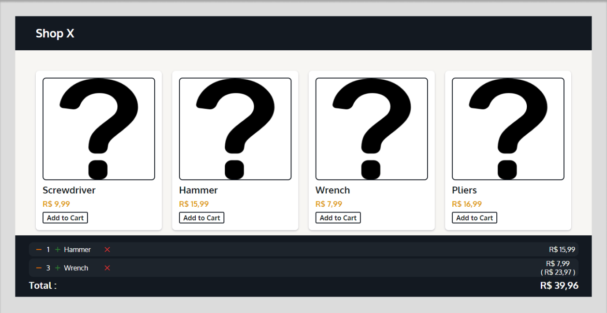
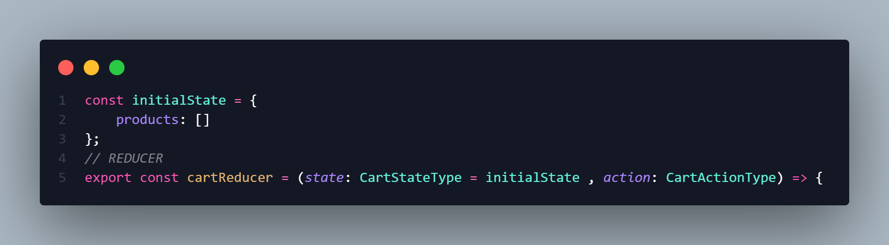
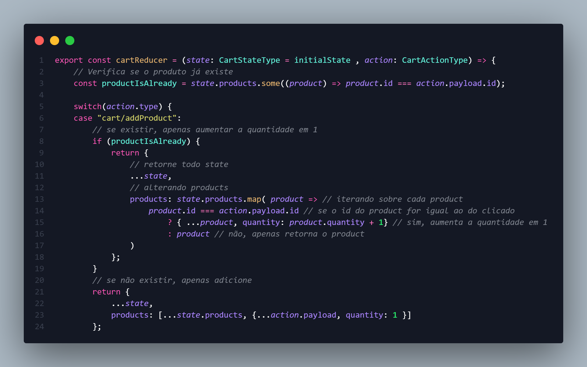
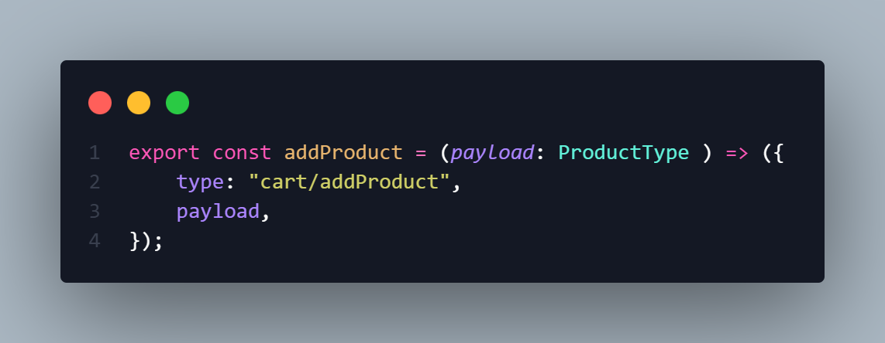
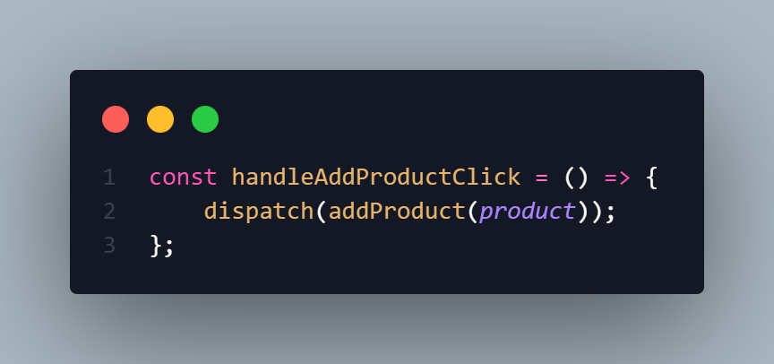
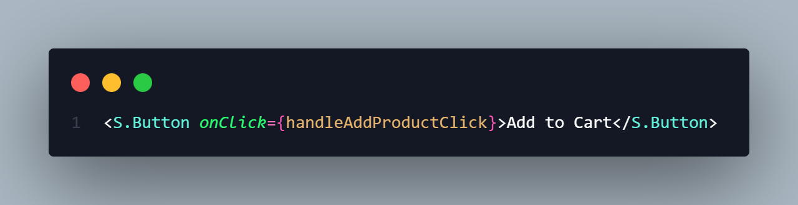
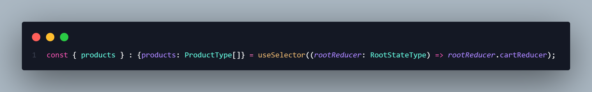

# Shop X

Uma página de uma loja virtual com seções de produtos e um carrinho de compras, que permite aos usuários adicionar produtos ao carrinho, ajustar as quantidades, e visualizar o valor unitário, o subtotal e o total da compra.

O projeto é de minha autoria e foi inspirado em outras aplicações existentes, adaptando seus designs e recursos. A aplicação foi construída utilizando as tecnologias TypeScript, React, Styled Components e Material-UI (MUI). Estou satisfeito com o resultado alcançado: 💻<https://shopx-ten.vercel.app/>.

 

## 🎯 Objetivos

Os usuários podem:
> - Avaliar o layout ideal da interface, considerando as dimensões da tela do dispositivo
> - Visualizar os estados de "hover" e "focus" para todos os elementos interativos presentes na página
> - Adicionar, remover e alterar a quantidade de produtos ao carrinho
> - Visualizar o valor unitário, o subtotal e o total

O objetivo deste projeto foi colocar em prática a arquitetura Flux, um padrão de gerenciamento de estado representado no React, por meio do Redux.

 

## 🔧 Propriedades e Tecnologias

> - Vite
> - TypeScript
> - React
> - Redux
> - Styled Components
> - Material-UI (MUI)

 

## 🧠 Meu aprendizado

> - Redux

Redux é uma implementação popular da arquitetura Flux em aplicativos JavaScript, especialmente em aplicações React. Ele segue os princípios da arquitetura Flux e fornece uma maneira robusta de gerenciar o estado da aplicação. Hoje, esta ferramenta conta com diversas melhorias, principalmente na redução da escrita de código padrão. No entanto, neste artigo, assim como no projeto, gostaria de discutir uma prática mais amplamente utilizada do Redux, que é a abordagem mais tradicional.

A essência do Redux é criar uma única fonte para o estado da aplicação e controlar estritamente como esse estado é atualizado. Ele é composto por quatro componentes principais: loja (store), ações (actions), despaches (dispatch) e exibição (view).

Dentro da store, encontramos os reducers, que são responsáveis por toda a lógica de gerenciamento de estado. No exemplo acima, vemos que a função 'cartReducer' é composta por dois argumentos, 'state' e 'action', onde 'state' já recebe uma declaração 'initialState', um array vazio chamado 'products', que representa o estado inicial do carrinho de compras, ou seja, sem produtos.

Dentro do reducer, convencionalmente utilizamos a estrutura condicional 'switch' para definir o que cada ação despachada irá fazer. No exemplo acima, vemos o 'case' de adicionar produtos.

Para realizar a alteração no estado, precisamos das ações. Cada ação é um objeto com duas propriedades, 'type' e 'payload', sendo necessária apenas a 'type', que irá indicar ao 'switch' do reducer em qual 'case' cairá.

O próximo passo é despachar as ações. Para isso, utilizamos o hook 'useDispatch' do Redux, referenciado em uma variável 'dispatch', passando a action como argumento.

Dessa forma, é só aplicar ao componente alvo.

Resta apenas recuperar o estado da loja. Para isso, podemos utilizar o hook 'useSelector', que nos dará acesso aos reducers. Utilizando a desestruturação de objetos, conseguimos extrair o objeto que desejamos.

À medida que acionamos o botão para adicionar produtos ao carrinho, o estado inicial é modificado, refletindo-se na renderização do componente.

[saiba mais!](https://redux.js.org/)

 

## 💻 Rodando o projeto

Para conferir a versão final é só acessar o link: 💻<https://shopx-ten.vercel.app/>.

 

## Autor

- LinkedIn - [Pedro A. Lima](https://www.linkedin.com/in/pedroalima6/)